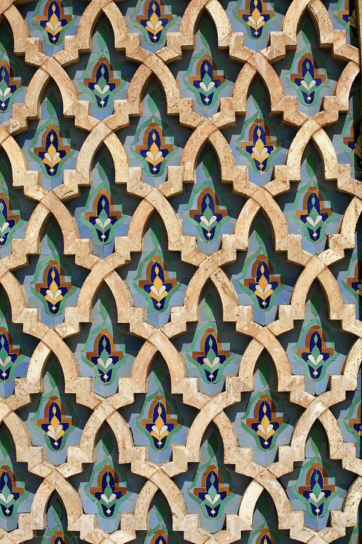

# 4475_Project1: Photo Mosaic

Developed by Noah Flanagan, Annarose Hilhorst, Dylan Paige, and Maxine Spencer

Running the mosaic_creator.py file with parameters of the input file path and desired output filepath.
Code for the transformation is found in mosaic_creator.py and transformers.py

Input Image            |  Output Image
:-------------------------:|:-------------------------:
 |  

